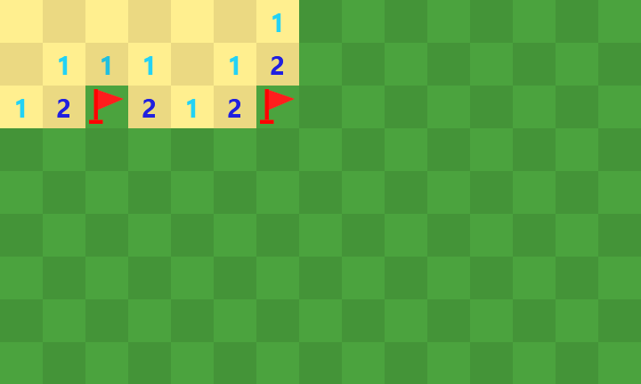

# The minesweeper

I think that everyone knows what this game is : mark all the bombs in as less time as possible, the whole
without making a single bomb explode.

In this repo, you will find a reproduction of this game. You can set the number of bombs, as well as the
width and the height of the board.

## Overview



## View and play

### Play

If you want to play my version of the game, head over to [this URL](https://MartinHeywang.github.io/minesweeper)

### Inspect

As a developer, you may be interested in inspecting the project. You can do the following steps:

```bash
# Make sure you are in the right folder, the one in which you want to clone the repo.
# The "minesweeper" folder will be created through the process.

# Clone the repo
gh repo clone MartinHeywang/minesweeper

# Serve it on localhost
# option: npm install serve --global
serve -s minesweeper
```
